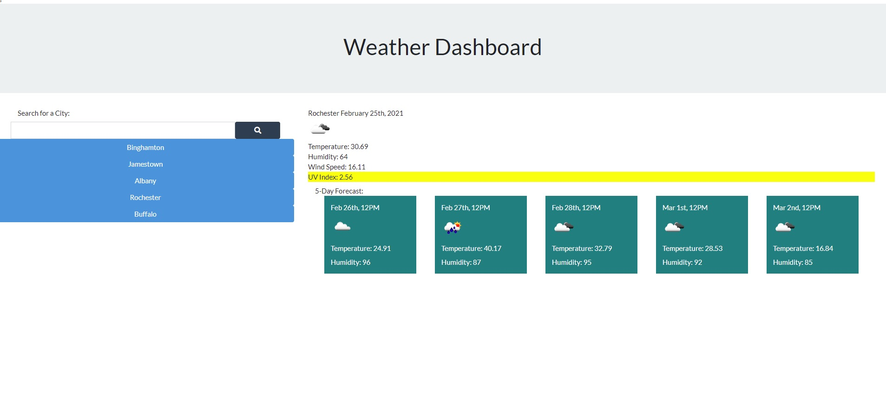
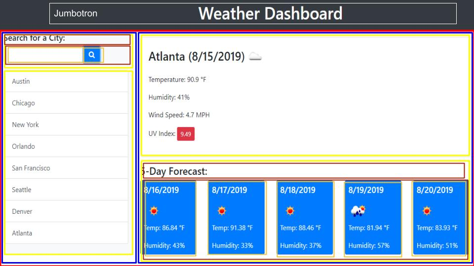

# weather_search
Using Open Weather API, to create a search and display of weather by city.

---
## Author

Shawn Fox

| [GitHub](https://github.com/SFoxGit) | [Email](sfoxss4@gmail.com) |

---
## Project Links:

- Deployed site: [GitHub Pages](https://sfoxgit.github.io/weather_search/)
- GitHub: [SFoxGit](https://github.com/SFoxGit/weather_search)

---
## Table of Contents

- [Description](##Description)

- [Requirements](##Requirements)

- [Progress](##Progress)

- [Contributions](##Contributing)

- [Credits](##Credits)

---
## Description

    AS A traveler
    I WANT to see the weather outlook for multiple cities
    SO THAT I can plan a trip accordingly

---
## Requirements

    GIVEN a weather dashboard with form inputs
    WHEN I search for a city
    THEN I am presented with current and future conditions for that city and that city is added to the search history
    WHEN I view current weather conditions for that city
    THEN I am presented with the city name, the date, an icon representation of weather conditions, the temperature, the humidity, the wind speed, and the UV index
    WHEN I view the UV index
    THEN I am presented with a color that indicates whether the conditions are favorable, moderate, or severe
    WHEN I view future weather conditions for that city
    THEN I am presented with a 5-day forecast that displays the date, an icon representation of weather conditions, the temperature, and the humidity
    WHEN I click on a city in the search history
    THEN I am again presented with current and future conditions for that city

---
### Must include:

Uses the OpenWeather API to retrieve weather data.

Uses localStorage to store persistent data.
    
---
## Progress
    
Step One:

*Instructions and outline*

    Html, css, javascript. 
    I'm going to use bootstrap for the html, and jquery for the javascript. 
    Form input for city name, that is variabled into the query string for the fetch api, and is also stored to local storage with a button dynamically created. 
    Display data from api in the html.
    Icon representation of weather which is in open weather (need to research)
    If statement for background of UV index.
    5 day forcast cards.

    Above is the provided example site image, broken down into sections to make my bootstrap easier. It's color coded so each step down within the container is the same.

Step Two:

*html*

    Created basic framework using bootstrap, I'm sure I'll have to go back and edit them all a bunch but that's fine because the design I outlined is there.

Step Three:

*javascript - buttons and api*

    I'm breaking up the javascript into multiple segments, starting with button function, then fetching api. That'll be a big step. Having to use the lat lon from the first fetch to get the second fetch was fun. 

*5 day forecast*

    So in order to do a true forecast at noon each day you've got to do moment and then set time in hours/minutes/seconds and then add number of days. Problem with the free version of openweathermap, is that in order to do a 5 day forecast like in the example you need 6 days (today + 5) which isn't free. I like my solution on getting the data for noon each day, however it could be condensed into for loops.

*local storage*

    For the save to local storage I needed a few ifs, check if it was null which if it was we had to create the array, then push the input value. If it did exist we need to take it and parse it. If the input value was already present in the local storage array we need to just move on, if it's not present we need to push it. I chose to unshift instead of push because I want to generate the buttons from the start of the array. 

*Generate buttons of past search*

    Possibly one of the most difficult parts. I set it up to limit the number of buttons, so things dont get out of hand. Issue with the way I did it, if you search X place then search a lot of others you wont be able to get it back into your recent searches, so just need to trim the local storage or in my check for save to local replace prexisting.

*index background*

    Suprisingly difficult, or at least I made it that way for myself. Ended up just hard coding the background into javascript.

Final thoughts:

This really badly needs a refactor, I could have condensed this code down a ton. But time is limited. The functionality of this is great! 

---
## Contributing

---
## Credits

[Open Weather](https://openweathermap.org/)

Bootstrap

Bootswatch

fontawesome
